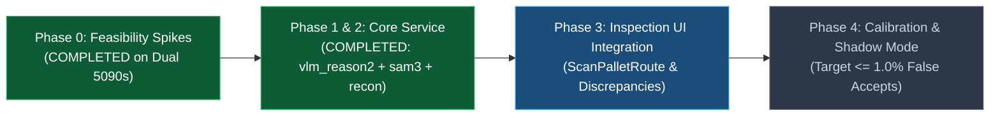
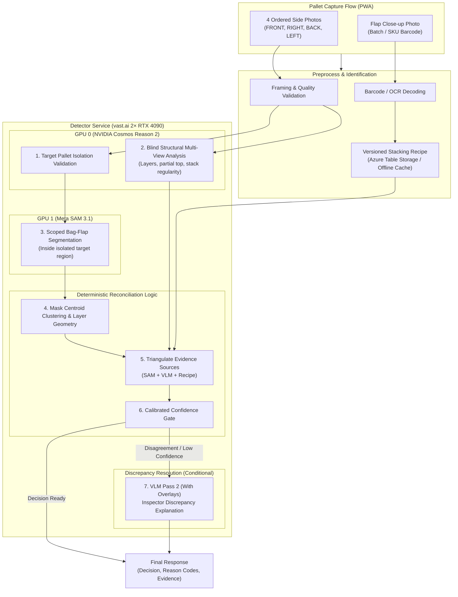

# Bag Counting Vision System: Architecture, Roadmap & Live Status

> **Live Status**: **Phase 0 & Phase 2 Core Service Completed (Dual NVIDIA RTX 5090 Verified)**  
> **Environment**: vast.ai VPS (2× NVIDIA RTX 5090 32GB GPUs)  
> **Model Stack**: Meta SAM 3 (`sam3`) on GPU 1 + NVIDIA Cosmos Reason (`nvidia/Cosmos-Reason2-8B`) on GPU 0 + Deterministic Stacking Recipe Reconciliation.

---

## Current Status & Progress Tracker

### Phase-by-Phase Breakdown

| Phase | Phase Name | Status | Deliverables Completed / Next |
| :--- | :--- | :---: | :--- |
| **Phase 0** | **Feasibility Spikes & VPS Benchmarks** | **COMPLETED** | ✔️ `detector-service/backup_training_data.py` ✔️ `public/bag-count-console.html` (Test tab, SKU calc, JSON/CSV export) ✔️ `detector-service/spike/test_cosmos_reason_multiview.py` (100% schema valid & repeatable) ✔️ `detector-service/spike/test_target_isolation.py` (141 samples evaluated) ✔️ Meta SAM 3 benchmarked on GPU 1 (0.9801 confidence) |
| **Phase 1 & 2** | **Core Two-Model Service Implementation** | **COMPLETED** | ✔️ `vlm_reason2.py` (NVIDIA Cosmos Reason on GPU 0) ✔️ `sam3_detector.py` (Meta SAM 3 on GPU 1) ✔️ `reconciliation.py` (Deterministic SKU Recipe Triangulation) ✔️ `app.py` (Exposed `POST /api/v1/analyze-pallet`) |
| **Phase 3** | **Inspection UI & Discrepancy Resolution** | **IN PROGRESS** | • Wire `ScanPalletRoute.tsx` into live detector endpoint • Inspector visual overlay & reason code breakdown |
| **Phase 4** | **Calibration, Shadow Mode & Validation** | *Pending* | • Calibrate against 40% Train / 30% Calib / 30% Locked Test split • Enforce Upper 95% Confidence Bound $\le 1.0\%$ false accepts |

---

## 1. System Architecture

---

## 2. Completed Work Details (Phase 0)

1. **Zero Data Loss & Backup Protection**:
   - Built [`detector-service/backup_training_data.py`](detector-service/backup_training_data.py) to locally pull and archive all Azure training manifests, CSV ground-truth data, and JPEG images.
   - Built browser-side 1-click **"Backup JSON"** and **"Export CSV"** buttons into the Bag-Count Console Review panel.
2. **Optimized Capture Protocol**:
   - Eliminated top photo requirements (seed pallets are 60BG full stacks covered with opaque top sheets).
   - Standardized on **4 square-on side views** (`FRONT`, `RIGHT`, `BACK`, `LEFT`) + flap close-ups.
3. **Console Modernization**:
   - Added SKU stacking recipe preview and validation.
   - Added interactive **Test / VLM** tab with multi-view analysis inspection.
4. **Spike Test Scripts**:
   - `detector-service/spike/test_cosmos_reason_multiview.py`: Tests 4-image single-request ingestion, 2x2 contact sheet fallback, and layer repeatability.
   - `detector-service/spike/test_sam3_seedbags.py`: Evaluates zero-shot flap segmentation precision/recall at $\text{IoU} = 0.50$.
   - `detector-service/spike/test_target_isolation.py`: Evaluates target pallet framing (70% frame) and background clutter rejection.

---

## 3. Next Action Items (vast.ai Benchmarking)

1. **Rent 2× RTX 4090 Instance on vast.ai**:
   - Run NVIDIA Cosmos Reason (`cosmos-reason2-8b`) container on GPU 0.
   - Run PyTorch 2.7+ / Meta SAM 3 checkpoint on GPU 1.
2. **Execute Feasibility Spikes**:
   - Run `python detector-service/spike/test_cosmos_reason_multiview.py`
   - Run `python detector-service/spike/test_sam3_seedbags.py`
   - Run `python detector-service/spike/test_target_isolation.py`
3. **Proceed to Phase 1**:
   - Purge deprecated RF-DETR/OWLv2 scripts and build the production container image.
