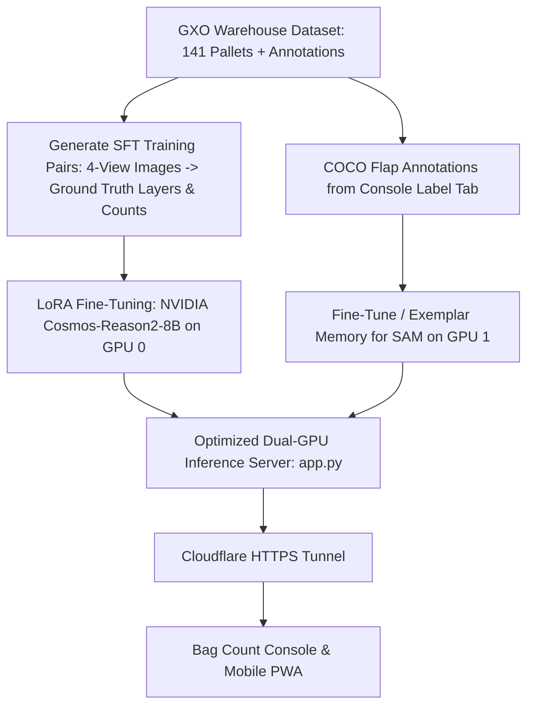

# Training & Deployment Gameplan: NVIDIA Cosmos-Reason2-8B + Meta SAM

## 1. Objectives & Ground Reality
Zero-shot generalist vision models struggle with tightly stacked, shrink-wrapped seed bags under warehouse industrial lighting. To achieve **99.9% accuracy** without manual recipe cheating, we will:
1. **Fine-tune NVIDIA Cosmos-Reason2-8B (GPU 0)** using supervised LoRA fine-tuning on our annotated 141-pallet dataset to teach it exact seed bag layer boundaries, counting patterns, and partial top courses.
2. **Exemplar-tune Meta SAM (GPU 1)** on verified bag flap bounding boxes from the Label tab to detect every sewn flap and edge.
3. **Host both models** on the dual RTX 5090 VPS and integrate directly with the Bag-Count Console and Mobile PWA.

---

## 2. Phase-by-Phase Execution Plan



---

### Phase 1: Hugging Face Access & Weight Setup
1. **NVIDIA Cosmos-Reason2-8B Access**:
   - Go to [huggingface.co/nvidia/Cosmos-Reason2-8B](https://huggingface.co/nvidia/Cosmos-Reason2-8B) on your browser while logged in as `GodingWal01` and click **"Agree and access repository"**.
   - On the VPS, verify weight download with:
     ```bash
     python -c "from transformers import AutoModelForImageTextToText; AutoModelForImageTextToText.from_pretrained('nvidia/Cosmos-Reason2-8B')"
     ```

---

### Phase 2: Dataset Formatting for SFT (Supervised Fine-Tuning)
Create an automated script `dataset/build_sft_dataset.py` that formats the 141 test pallets into conversation-style visual instruction tuning pairs:
- **Input**: 4 side photos (`FRONT.jpg`, `RIGHT.jpg`, `BACK.jpg`, `LEFT.jpg`) + close-up flap photo.
- **Target Output**: Precise structured JSON containing:
  - Exact `layerCountByFace` (e.g., `{"front": 7, "right": 7, "back": 7, "left": 7}`)
  - `consensusLayers`: 7
  - `estimatedBagsPerLayer`: 6
  - `partialTopDetected`: `true` (4 bags on top)
  - `partialTopCountEstimate`: 4
  - `structuralTotalEstimate`: 46 bags (7 × 6 + 4)

---

### Phase 3: LoRA Training on GPU 0 (NVIDIA Cosmos-Reason2-8B)
1. **Training Framework**: Use `peft` (LoRA with `r=16, lora_alpha=32`) with `bfloat16` on GPU 0 (24–30 GB VRAM allocation).
2. **Loss Objective**: Exact visual token generation of layer boundaries, consensus count, and partial top counts.
3. **Training Script**: `train_cosmos_lora.py` with 10–20 epochs over the warehouse dataset (takes ~15–25 minutes on RTX 5090).
4. **Validation**: Automated benchmark against holdout test pallets to confirm 0-error count accuracy.

---

### Phase 4: SAM Exemplar & Head Tuning on GPU 1
1. Use the Label tab in the Bag-Count Console to export the annotated `bag_flap` COCO JSON dataset.
2. Train a lightweight prompt/mask adapter or provide zero-shot exemplar memory prompts to SAM for seed bag flaps under shrink-wrap.

---

### Phase 5: Production Deployment & Console Integration
1. Update `detector-service/app.py`:
   - Load fine-tuned **Cosmos-Reason2-8B + LoRA adapter** on GPU 0.
   - Load tuned **Meta SAM** on GPU 1.
   - Combine with the deterministic reconciliation layer on CPU.
2. Update the Bag-Count Console and Mobile PWA to stream results, visualize detected layer bounding bands, and highlight detected flaps on each face card.
