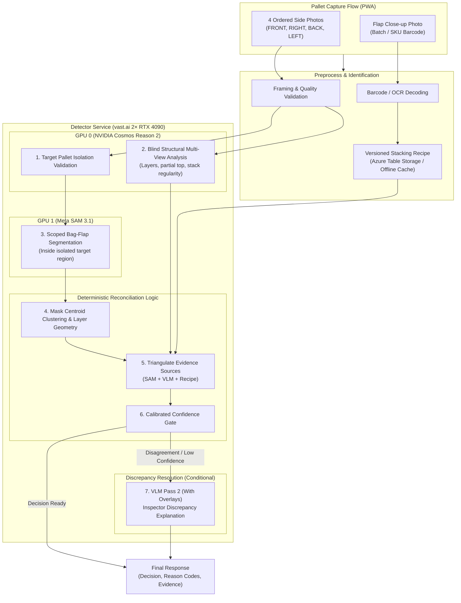

# Bag Counting Vision System: Architecture & Implementation Plan

> **Current Status**: **Phase 0 (Feasibility Spike Scripts & Console Upgrades Completed)**  
> **Target Environment**: vast.ai VPS (2× NVIDIA RTX 4090 24GB GPUs)  
> **Model Stack**: Meta SAM 3 (`sam3.1`) for bag flap segmentation + NVIDIA Cosmos Reason (`cosmos-reason2-8b`) for physical/structural reasoning.

---

## 1. Executive Summary & Problem Formulation

The warehouse loadout operation requires robust, automated bag counting for stacked seed pallets prior to shipment. Seed pallets typically hold 60 bags ($10\text{ layers} \times 6\text{ bags/layer}$) or custom partial counts, wrapped in industrial stretch wrap and often covered by opaque top sheets.

Previous single-model detection attempts (RF-DETR, OWLv2) suffered from background clutter confusion and lack of 3D spatial awareness. This system replaces them with a **triangulated three-evidence architecture**:

1. **Visible Bag-Flap Evidence**: Meta SAM 3 zero-shot instance segmentation on visible bag flaps per face.
2. **Structural Spatial Reasoning**: NVIDIA Cosmos Reason (`cosmos-reason2-8b`) blind multi-view layer counting, partial top detection, and irregularity evaluation.
3. **Inventory-Rule Evidence**: Server-side versioned stacking recipes keyed by SKU / Material Number ($N\text{ layers} \times M\text{ bags/layer} + \text{partial}$).

---

## 2. System Architecture

---

## 3. Progress Tracker & Phase Roadmap

| Phase | Description | Status | Deliverables |
| :--- | :--- | :---: | :--- |
| **Phase 0** | **Feasibility Spikes & Console Modernization** | **IN PROGRESS** *(Scripts & UI Done; VPS Benchmarking Next)* | `spike/test_cosmos_reason_multiview.py` `spike/test_sam3_seedbags.py` `spike/test_target_isolation.py` `backup_training_data.py` Updated `bag-count-console.html` |
| **Phase 1** | **Backend Purge & vast.ai Containerization** | *Pending Phase 0 Run* | Delete obsolete RF-DETR/OWLv2 files `Dockerfile.vastai` `docker-compose.vastai.yml` |
| **Phase 2** | **Core Service Implementation** | *Pending* | `vlm_reason2.py` `sam3_detector.py` `reconciliation.py` `POST /api/v1/analyze-pallet` |
| **Phase 3** | **Inspection UI & Discrepancy Resolution** | *Pending* | `ScanPalletRoute.tsx` integration Discrepancy viewer & reason code display |
| **Phase 4** | **Calibration, Shadow Mode & Validation** | *Pending* | 40/30/30 dataset split Target $\le 1.0\%$ upper 95% bound on false automatic accepts |

---

## 4. Current Work Completed (Phase 0 Detail)

1. **Zero Data Loss & Backup Protection**:
   - Implemented [`detector-service/backup_training_data.py`](../detector-service/backup_training_data.py) to download complete JSON manifests, ground-truth CSVs, and high-resolution JPEG photos to timestamped local archives.
   - Added browser-side 1-Click **"Backup JSON"** and **"Export CSV"** buttons in the Bag-Count Console.
2. **Capture Protocol Optimization**:
   - Removed impractical elevated top view requirements (full 60BG pallets use opaque top sheets).
   - Standardized on **4 square-on side views** (`FRONT`, `RIGHT`, `BACK`, `LEFT`) plus bag flap close-ups.
3. **Console Modernization**:
   - Added live SKU/Material stacking recipe calculator.
   - Added interactive **Test / VLM** tab with multi-view analysis inspection.
4. **Feasibility Spike Test Harnesses**:
   - `detector-service/spike/test_cosmos_reason_multiview.py`: Validates 4-image single-request ingestion, 2x2 contact sheet fallback, and layer count repeatability.
   - `detector-service/spike/test_sam3_seedbags.py`: Validates zero-shot flap segmentation precision/recall at $\text{IoU} = 0.50$.
   - `detector-service/spike/test_target_isolation.py`: Validates center framing (70% frame) and background aisle stack rejection.

---

## 5. Next Action Items (Executing Phase 0 on vast.ai)

1. **Provision 2× RTX 4090 Instance on vast.ai**:
   - GPU 0: NVIDIA Cosmos Reason container (`cosmos-reason2-8b`) on port 8000 (internal Docker network).
   - GPU 1: PyTorch 2.7+ / CUDA 12.6 environment with Meta SAM 3 checkpoint.
2. **Execute Benchmark Harnesses**:
   - Run `test_cosmos_reason_multiview.py` against pallet dataset to verify layer repeatability and payload formatting.
   - Run `test_sam3_seedbags.py` to record baseline F1 scores on seed bag flap concepts.
   - Run `test_target_isolation.py` to confirm background warehouse rejection.
3. **Proceed to Phase 1**:
   - Remove deprecated RF-DETR code and build the unified production multi-GPU container service.
