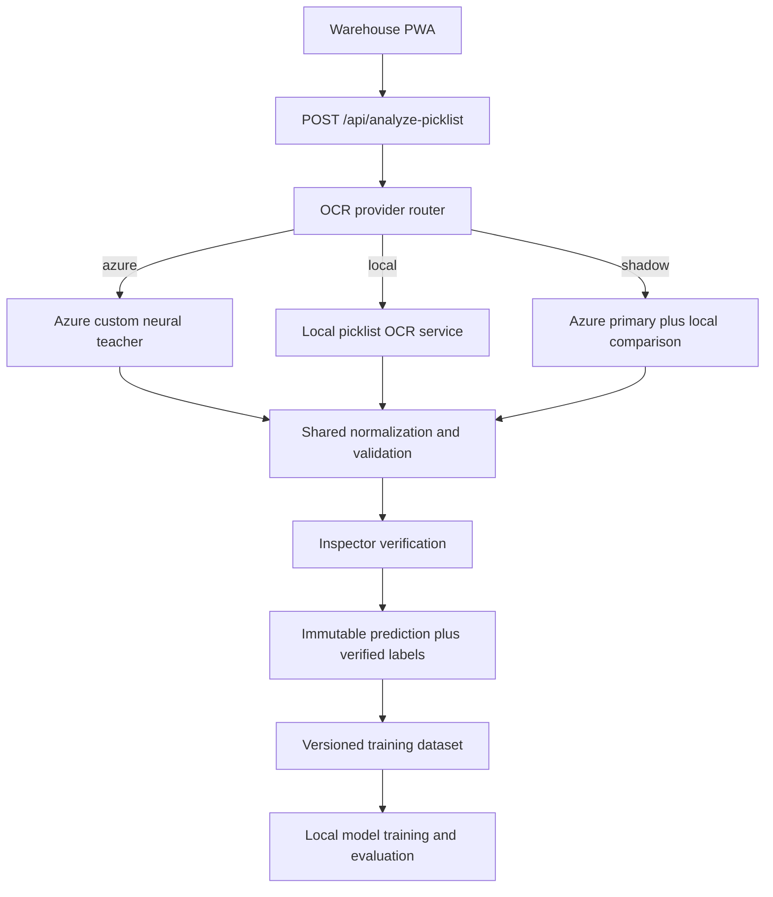

# Picklist OCR: Azure Teacher to Local Student Plan

> **Status:** Planning  
> **Last updated:** 2026-09-02  
> **Current production path:** Azure AI Document Intelligence custom model (`Picklist`)  
> **Target path:** Local PP-StructureV3 plus a picklist-tuned PaddleOCR recognizer, with Azure retained temporarily as a teacher and fallback

---

## 1. Objective

Replace Azure Document Intelligence for picklist extraction with a private local service that:

- Meets or exceeds the current exact-match accuracy for SKU, batch, quantity, UOM, and delivery assignment.
- Preserves table cells and coordinates instead of returning unstructured text only.
- Runs behind the existing `POST /api/analyze-picklist` contract, so the warehouse capture workflow remains stable.
- Learns from human-confirmed picklists without copying Azure model weights.
- Falls back safely to human review, and temporarily to Azure, when confidence or validation is insufficient.

Azure does not expose weights, hidden features, or token probabilities. In this plan, "distillation" means teacher-assisted dataset creation: Azure produces structured predictions, inspectors correct them, and a smaller local model trains on the verified results.

## 2. Success Metrics

The local model may become the default only after passing a locked, load-grouped test set.

| Metric | Release gate | Measurement |
| --- | ---: | --- |
| SKU exact match | >= 99.8% | Correct characters and complete field |
| Batch-code exact match | >= 99.5% | Correct characters and complete field |
| Quantity and UOM exact match | >= 99.5% | Both fields correct on the same row |
| Complete-row recall | >= 99.0% | Expected rows found without extra/subtotal rows |
| Delivery assignment | >= 99.5% | Row assigned to the correct delivery section |
| Header exact match | >= 99.5% | Load number and ship date |
| Silent validation failures | 0 | Invalid result must be reviewed or rejected |
| Manual correction rate | No worse than Azure | Compared during shadow operation |

Latency and throughput targets will be set after measuring the production capture rate and target OCR hardware.

## 3. Target Architecture



The browser-facing response stays provider-neutral. Azure-specific and Paddle-specific response formats are converted server-side.

## 4. Model Strategy

### Initial production candidate

- **Layout and table structure:** PP-StructureV3.
- **Text recognition:** benchmark the English and Latin PP-OCR recognition models.
- **Final recognizer:** fine-tune whichever base model has the highest field-level exact match on the picklist validation set.
- **Post-processing:** deterministic picklist normalization, inventory matching, and delivery grouping.

The English model is the expected starting point because all forms are English. The Latin model remains a benchmark candidate because the documents contain arbitrary uppercase batch codes, numeric material identifiers, abbreviations, and punctuation rather than normal English prose.

### Optional second-stage model

A compact document VLM such as PaddleOCR-VL or Granite-Docling may later adjudicate low-confidence rows. It must not silently override deterministic OCR without passing domain validation.

## 5. Data Contract

Every OCR run needs an immutable server-side record containing:

```json
{
  "inferenceId": "uuid",
  "inspectionId": "inspection-id",
  "photoId": "photo-id",
  "provider": "azure",
  "modelVersion": "picklist-v2",
  "startedAt": "2026-09-02T00:00:00Z",
  "durationMs": 1250,
  "prediction": {
    "header": {},
    "lineItems": []
  },
  "geometry": {
    "pages": [],
    "tables": []
  },
  "validationWarnings": [],
  "verified": null
}
```

When the inspector verifies the picklist, attach a separate verified snapshot rather than overwriting the prediction. Each predicted row needs a stable `sourceRowId`, and resulting application lines need to retain that ID even when SP or MB rows are expanded.

The verified snapshot is the training target. Raw Azure output alone is not ground truth.

## 6. Implementation Tracker

### Phase 0 — Baseline and decisions

**Status:** Pending

- [ ] Confirm Microsoft contractual and GXO governance approval for teacher-assisted dataset creation.
- [ ] Identify every active SAP picklist layout and site variation.
- [ ] Document expected peak pages per minute and acceptable response time.
- [ ] Confirm OCR deployment hardware and whether a third GPU is available.
- [ ] Assemble a representative, access-controlled baseline set.
- [ ] Split data by entire load into train, calibration, and locked test sets.
- [ ] Run the current Azure model on the locked baseline and record field-level metrics.

**Exit criteria:** Baseline report exists, data retention is approved, and the locked test set is frozen.

### Phase 1 — Provider-neutral OCR contract

**Status:** Pending

- [ ] Extend `PicklistOcrResult` with `inferenceId`, provider, model version, duration, confidence, warnings, and stable row IDs.
- [ ] Add a server-side provider interface for Azure and local implementations.
- [ ] Add `PICKLIST_OCR_MODE=azure|local|shadow`.
- [ ] Keep `/api/analyze-picklist` backward compatible during the migration.
- [ ] Add contract tests covering all three modes and fallback behavior.
- [ ] Ensure provider credentials and private service URLs never reach the browser bundle.

**Primary files:**

- `api/src/index.ts`
- `src/shared/services/ocr.ts`
- `src/routes/CapturePicklistRoute.tsx`
- New `api/src/picklist-ocr/` provider modules

**Exit criteria:** Azure still drives the UI through the new provider-neutral contract with no regression.

### Phase 2 — Prediction and verification capture

**Status:** Pending

- [ ] Create a dedicated picklist OCR inference table and image/geometry storage layout.
- [ ] Save the original prediction before client mapping, page merging, or UOM expansion.
- [ ] Preserve `sourcePageId` and `sourceRowId` through verification.
- [ ] Save the final verified header, deliveries, and source rows when `VERIFY_PICKLIST` occurs.
- [ ] Record field edits as predicted-versus-verified values without storing unnecessary personal information.
- [ ] Add retry-safe and idempotent uploads for intermittent warehouse connectivity.
- [ ] Add retention, deletion, and access-control tests.

**Exit criteria:** A captured page can be traced from its image and original inference to a human-confirmed structured label.

### Phase 3 — Model-independent normalization and validation

**Status:** Pending

- [ ] Move Azure-independent parsing rules out of the Azure handler.
- [ ] Validate SKUs against the inventory catalog.
- [ ] Constrain UOM to `BG`, `SP`, `MB`, `PL`, and `C62` while retaining legacy compatibility.
- [ ] Validate batch, delivery, quantity, and date formats.
- [ ] Replace unconditional ambiguous-character substitutions with candidate generation and evidence-based resolution.
- [ ] Detect subtotals, duplicate rows, page-boundary repeats, and split rows.
- [ ] Return explicit validation warnings and `needsReview`.
- [ ] Add regression fixtures for every known picklist failure mode.

**Proposed module layout:**

```text
api/src/picklist-ocr/
  contract.ts
  normalize.ts
  validate.ts
  reconcile.ts
  providers/
    azure.ts
    local.ts
```

**Exit criteria:** The same normalization and validation suite can process either Azure or local raw output.

### Phase 4 — Improve the Azure teacher

**Status:** Pending

- [ ] Train a v4 custom neural model using representative phone captures.
- [ ] Label load number, ship date, delivery number, and the complete line-item table.
- [ ] Include at least 20–30 representative pages for each materially different layout before promotion.
- [ ] Include difficult image and character conditions deliberately.
- [ ] Use row/cell confidence in acceptance and review rules.
- [ ] Compare the new teacher against the existing `Picklist` model on the locked test set.
- [ ] Promote only if field-level exact-match accuracy improves without a recall regression.

**Exit criteria:** A versioned Azure teacher produces the best available verified labels and a reproducible evaluation report.

### Phase 5 — Dataset export and quality controls

**Status:** Pending

- [ ] Build an admin-only exporter for images, verified JSON, geometry, and metadata.
- [ ] Export a manifest with dataset version, schema version, SHA-256 hashes, and split assignment.
- [ ] Exclude incomplete, unverified, duplicate, and policy-ineligible records.
- [ ] Permit high-confidence pseudo-labels only when every domain validation passes.
- [ ] Mark human-confirmed and pseudo-labeled records distinctly.
- [ ] Add dataset validation for missing rows, bad polygons, leakage, and inconsistent labels.
- [ ] Store dataset releases immutably; never silently rewrite a published version.

**Exit criteria:** One command produces a validated, versioned dataset with a frozen test split.

### Phase 6 — Local OCR service and baseline

**Status:** Pending

- [ ] Create an isolated `ocr-service/` FastAPI service and container.
- [ ] Implement orientation, perspective correction, resizing, and contrast normalization.
- [ ] Integrate PP-StructureV3 table extraction.
- [ ] Benchmark English and Latin recognition models without fine-tuning.
- [ ] Map local cells and coordinates into the shared OCR contract.
- [ ] Add health, readiness, authentication, size limit, timeout, and bounded-queue behavior.
- [ ] Add deterministic tests using sanitized picklist fixtures.
- [ ] Produce baseline accuracy, latency, CPU, GPU, and memory measurements.

**Exit criteria:** The local service processes the locked test set and can be called through the Azure Function without changing the PWA.

### Phase 7 — Student fine-tuning

**Status:** Pending

- [ ] Generate word, line, and table-cell crops from verified geometry.
- [ ] Fine-tune the strongest base recognizer on picklist characters and sequences.
- [ ] Oversample validated `B/8`, `0/O`, `1/I`, and `5/S` cases without creating test leakage.
- [ ] Compare the fine-tuned English and Latin candidates by exact field match.
- [ ] Calibrate field confidence on the calibration split.
- [ ] Fine-tune table structure only if table errors remain a meaningful failure source.
- [ ] Version weights, configuration, training code, dataset ID, and evaluation results together.

**Exit criteria:** A reproducible student checkpoint improves materially over the pretrained local baseline.

### Phase 8 — Shadow deployment

**Status:** Pending

- [ ] Deploy the local service privately without exposing its port publicly.
- [ ] Run Azure as the UI-driving primary and local OCR as the shadow provider.
- [ ] Prevent the shadow call from delaying or failing the inspector workflow.
- [ ] Record Azure, local, and verified results under the same inference group.
- [ ] Build comparison reporting by field, layout, site, image quality, and model version.
- [ ] Monitor latency, queue depth, resource contention, and correction rate.
- [ ] Investigate every silent high-confidence disagreement.

**Exit criteria:** The local model passes release gates across an agreed production observation window.

### Phase 9 — Controlled cutover

**Status:** Pending

- [ ] Change the local provider to primary for an initial site or controlled percentage of traffic.
- [ ] Keep Azure fallback for local errors, low confidence, and validation failures.
- [ ] Define rollback triggers and verify that switching back requires configuration only.
- [ ] Expand traffic only when operational and accuracy metrics remain within gates.
- [ ] Remove Azure fallback only after an agreed stability period and cost/risk review.
- [ ] Continue collecting human-confirmed examples for drift monitoring.

**Exit criteria:** Local OCR is the default, rollback is tested, and Azure dependency is retired or explicitly retained as fallback.

## 7. GitHub Milestones

| Milestone | Phases | Deliverable |
| --- | --- | --- |
| M1 — Trustworthy labels | 0–2 | Baseline, immutable predictions, verified targets |
| M2 — Shared extraction rules | 3 | Provider-independent normalization and validation |
| M3 — Strong teacher | 4 | Improved and evaluated Azure custom neural model |
| M4 — Reproducible dataset | 5 | Versioned dataset export and validation |
| M5 — Local baseline | 6 | Containerized PP-StructureV3 service |
| M6 — Tuned student | 7 | Picklist-tuned recognizer and evaluation report |
| M7 — Production validation | 8 | Shadow-mode results and release decision |
| M8 — Migration complete | 9 | Controlled local-first deployment and rollback plan |

Suggested GitHub labels: `picklist-ocr`, `ml`, `data`, `api`, `frontend`, `infrastructure`, `evaluation`, and `security`.

## 8. Key Risks and Controls

| Risk | Control |
| --- | --- |
| Azure mistakes contaminate student labels | Train primarily on human-confirmed targets; restrict pseudo-labels |
| Random split inflates accuracy | Split by complete load and freeze the test set |
| OCR returns plausible but incorrect digits | Inventory and format validation; exact-match metrics; review gate |
| Page merge or UOM expansion destroys row provenance | Stable source page/row IDs and immutable pre-transform predictions |
| Local service competes with pallet vision GPUs | Isolated service; benchmark CPU first; separate GPU or explicit scheduling |
| Shadow inference delays warehouse capture | Asynchronous/bounded shadow work with no effect on primary response |
| Model or data changes cannot be reproduced | Version dataset, schema, weights, configuration, and reports together |
| Sensitive operational documents are over-retained | Access control, retention policy, deletion workflow, and audit logging |

## 9. Open Decisions

- [ ] Confirm whether the target runtime is CPU-only, a third GPU, or scheduled sharing on the dual-GPU host.
- [ ] Set image and label retention periods.
- [ ] Decide whether Azure remains a long-term fallback after local cutover.
- [ ] Set required shadow duration and minimum production sample size.
- [ ] Select the approver for model promotion and rollback.
- [ ] Decide whether BOL OCR enters this migration after picklist OCR succeeds.

## 10. Immediate Next Work

The first implementation pull request should cover only the instrumentation foundation:

- [ ] Define the provider-neutral contract and inference metadata.
- [ ] Add stable source row identifiers.
- [ ] Store immutable Azure predictions.
- [ ] Capture the final verified snapshot.
- [ ] Add tests proving that manual edits do not erase the original prediction.

Do not begin local fine-tuning until this foundation is deployed and producing trustworthy labels.

## References

- [Azure Document Intelligence custom models](https://learn.microsoft.com/en-us/azure/ai-services/document-intelligence/train/custom-model?view=doc-intel-4.0.0)
- [Azure custom neural model guidance](https://learn.microsoft.com/en-us/azure/ai-services/document-intelligence/train/custom-neural?view=doc-intel-4.0.0)
- [PaddleOCR](https://github.com/PaddlePaddle/PaddleOCR)
- [PP-StructureV3 usage](https://github.com/PaddlePaddle/PaddleOCR/blob/main/docs/version3.x/pipeline_usage/PP-StructureV3.en.md)

